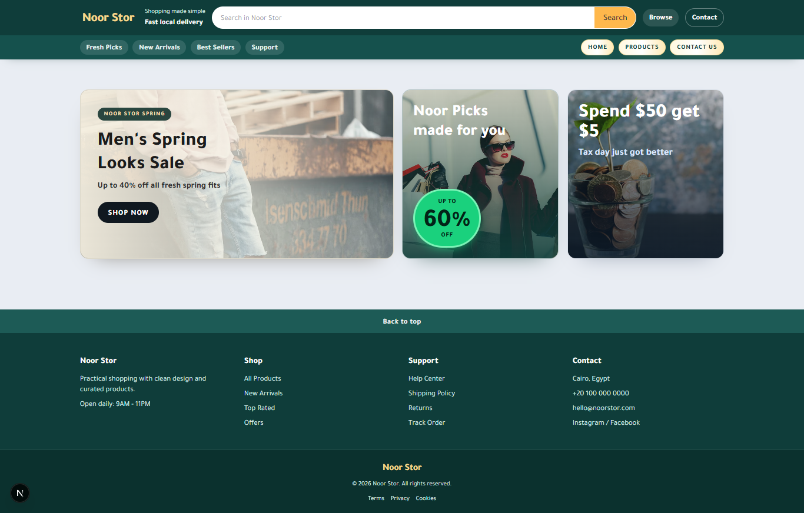
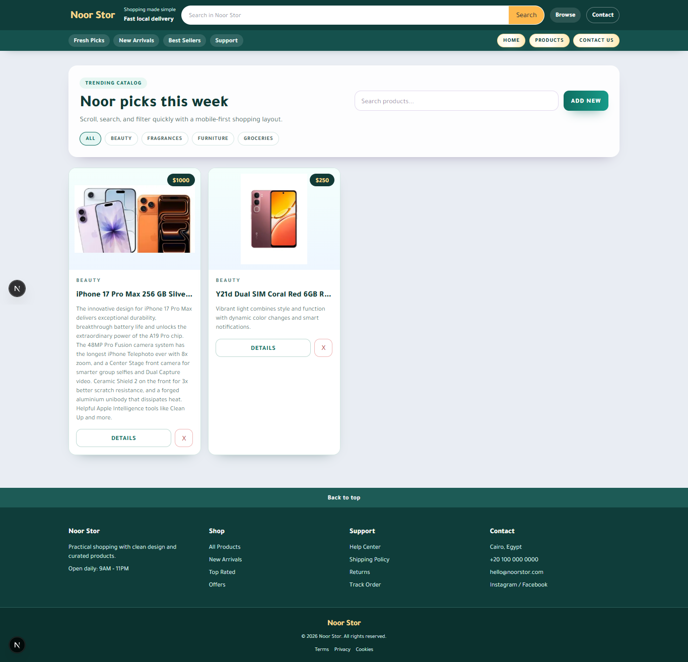
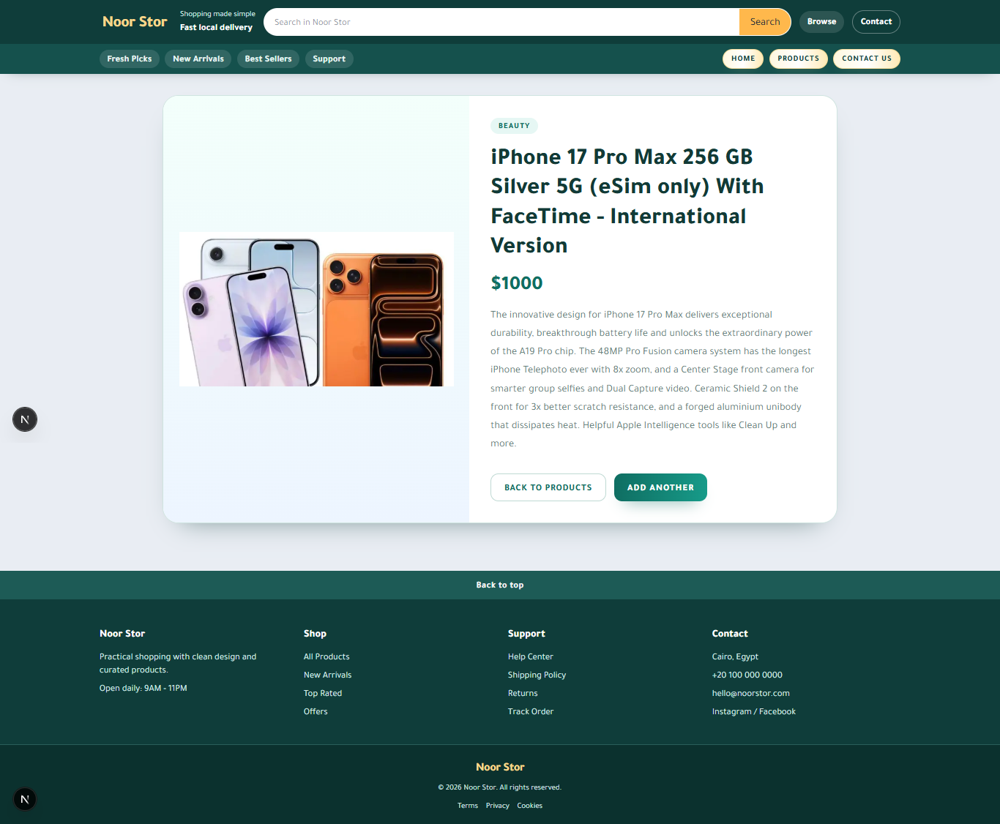
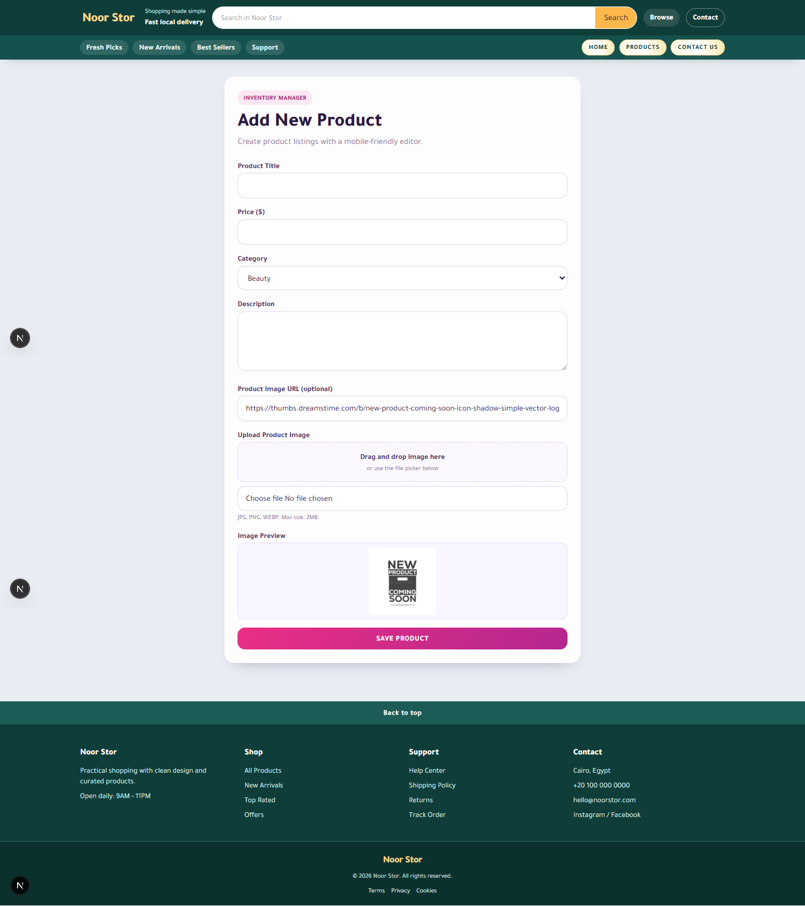
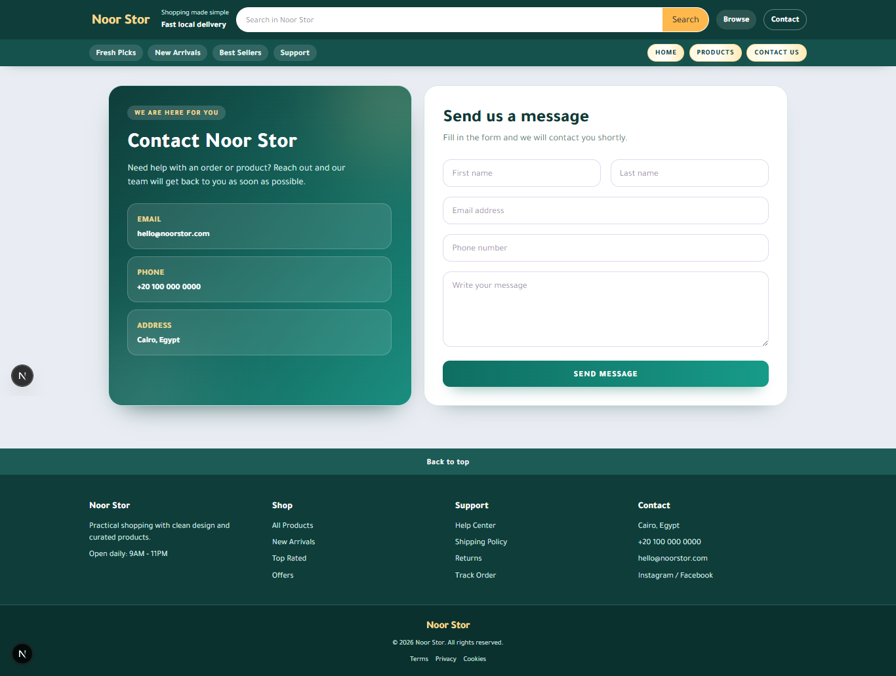

# Noor Stor (Next.js + Mongoose)

Simple e-commerce demo built with Next.js (Pages Router), Node.js API routes, and Mongoose.

## Requirements

- Node.js 18+
- npm
- MongoDB (local or cloud)

## Install

```bash
npm install
```

Set your connection string:

```bash
MONGODB_URI=mongodb://127.0.0.1:27017/noor_stor
```

For local development, put the same value in `.env.local` at the project root.

## Run in development

```bash
npm run dev
```

## URLs

- App: http://localhost:3000
- API (list/create): http://localhost:3000/api/products
- API (buy): http://localhost:3000/api/products/:id/buy
- API (totals): http://localhost:3000/api/purchases/total
- API news list/create: http://localhost:3000/api/news
- API news item: http://localhost:3000/api/news/:id

## Implemented Features

- Full product CRUD through Node.js API routes with Mongoose.
- Full news CRUD through Node.js API routes with Mongoose.
- Buy product endpoint plus running total purchased amount.
- ISR for products list and product details with a 5 minute refresh window.
- DB-backed news page with add/edit/delete actions.

## Build

```bash
npm run build
```

## Screenshots










